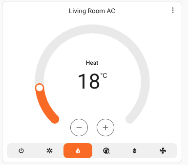

# Fujitsu AC MQTT Climate Component for Home Assistant

A custom Home Assistant component that enables control of Fujitsu air conditioners through MQTT controlled IR blaster (like https://www.athom.tech/blank-1/tasmota-ir-controller). This component allows you to integrate your Fujitsu AC unit with Home Assistant, providing full control over temperature, mode and other settings.



## Features

- Control multiple AC modes (Cool, Heat, Auto, Dry, Fan Only)
- Adjust temperature
- Control fan speed
- Control swing

## Installation

1. Create a custom_components directory in your Home Assistant configuration directory if it doesn't exist
2. Create a directory called `ir_climate` inside the custom_components directory
3. Copy all the files from this repository into the `ir_climate` directory:
   - `__init__.py`
   - `climate.py`
   - `manifest.json`
   - `strings.json`

## Configuration

Add the following to your `configuration.yaml`:

```yaml
climate:
  - platform: ir_climate
    name: "My Fujitsu AC"
    topic: "home/ac/livingroom/command" #copy the name of the topic from your IR blaster settings
    qos: 2  # Optional (default: 2)
    retain: false  # Optional (default: false)
```

## Version

Current version: 1.0.0

## Notes

- The component assumes the AC unit supports IR control through an MQTT-enabled IR blaster
- Temperature is always in Celsius
- Make sure your MQTT broker is properly configured in Home Assistant
- Ensure your IR blaster is properly set up and can receive commands via MQTT

## License

This project is licensed under the MIT License - see the [LICENSE](LICENSE) file for details.
